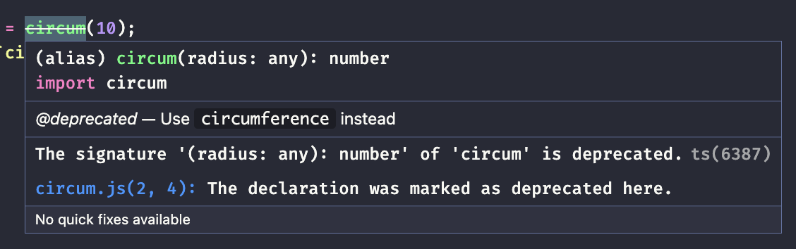
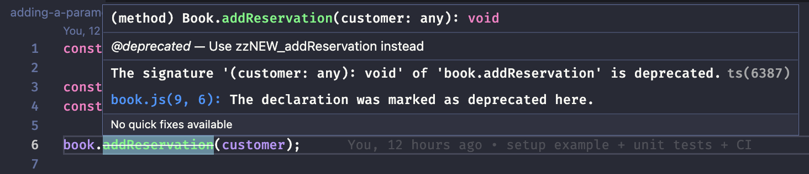

[](https://github.com/kaiosilveira/change-function-declaration-refactoring/actions/workflows/ci.yml)

ℹ️ _This repository is part of my "refactoring" catalog based on Fowler's book with the same title. Please see [kaiosilveira/refactoring](https://github.com/kaiosilveira/refactoring) for more details._

---

# Change function declaration

**Formerly: Rename Method**
<br/>
**Formerly: Add Parameter**
<br/>
**Formerly: Remove Parameter**
<br/>
**aka: Rename Function**
<br/>
**aka: Change Signature**

<table>
<thead>
<th>Before</th>
<th>After</th>
</thead>
<tbody>
<tr>
<td>

```javascript
function circum(radius) {
  // ...
}
```

</td>

<td>

```javascript
function circumference(radius) {
  // ...
}
```

</td>
</tr>
</tbody>
</table>

Functions are an integral part of programming in general, they are everywhere, in different forms and syntaxes. When it comes to maintaining them, though, things can get tricky. We might want to change a function name or add a new parameter to it for some reason, just to figure out that this function is widely referenced throughout the codebase, even by some reflective structure sometimes, making it harder for automated refactoring tools to do their job. This is what often causes us to give up and leave it as is, increasing code problems and technical debt over time. This refactoring comes in handy to approach even the more complex cases, using deprecating strategies and small steps that keep the code releasable at any time.

## Working examples

There are three working examples for this refactoring, starting from the simplest case that can be done with the aid of automatic refactoring tools, until the more complex cases when we need to worry about many callers being slowly updated over time, deprecate warnings, etc.

### Working example #1: A function to calculate circumferences

This working example brings a simple function that calculates circumferences and we want to rename it so its intent is more clear to the client code. Two mechanics are presented in the book: The simple and migration mechanics.

The simple mechanics can be used when there are only a few callers and we know them all, so we can simply rename the function and update its callers at the same time, finishing the refactoring in pretty much one single step.

The migration mechanics, though, is a little bit more involved. It's used when there are many callers and we don't want / cannot update them all in a single step. For this case, we introduce a new function and deprecate the old one, giving the clients some time to migrate. Then, after they're all migrated to the new signature, we remove the deprecated code.

#### Before

The starting code for the `circum` function looks like this:

```javascript
function circum(radius) {
  return 2 * Math.PI * radius;
}
```

#### After

The final code for the `circumference` function looks like this:

```javascript
function circumference(radius) {
  return 2 * Math.PI * radius;
}
```

#### Test suite

For the two mechanics, the test suite for this function is pretty straightforward and remains the same. It contains only one test to make sure that the circumference is calculated correctly for a given radius.

```javascript
describe('circum', () => {
  it('should calculate the circumference for a given radius', () => {
    const result = circum(10);
    expect(62.83185307179586).toEqual(result);
  });
});
```

#### Steps

See below the steps to perform this refactoring, using both the simple and the migration mechanics.

##### Simple mechanics

Using the simple mechanics, we simply rename the function and update its callers straightaway:

```diff
diff --git a/simple-mechanics/circum.js b/simple-mechanics/circum.js
@@ -1,5 +1,5 @@
-function circum(radius) {
+function circumference(radius) {
   return 2 * Math.PI * radius;
 }

-module.exports = { circum };
+module.exports = { circumference };

diff --git a/simple-mechanics/circum.test.js b/simple-mechanics/circum.test.js
@@ -1,8 +1,8 @@
-const { circum } = require('./circum');
+const { circumference } = require('./circum');

 describe('circum', () => {
   it('should calculate the circumference for a given radius', () => {
-    const result = circum(10);
+    const result = circumference(10);
     expect(62.83185307179586).toEqual(result);
   });
 });

diff --git a/simple-mechanics/index.js b/simple-mechanics/index.js
@@ -1,4 +1,4 @@
-const { circum } = require('./circum');
+const { circumference } = require('./circum');

-const result = circum(10);
+const result = circumference(10);
 console.log(`circumference is: ${result}`);
```

The commit history, of course, looks pretty simple:

| Commit SHA                        | Message                                           |
| --------------------------------- | ------------------------------------------------- |
| [ebecbf8](https://bit.ly/3KMpxsJ) | rename circum to circumference and update callers |

##### migration mechanics

Using the migration mechanics, we need to be more careful. First, we introduce a new function, with the name we want it to be. In our case, `circumference` (and add some tests to it):

```diff
diff --git a/migration-mechanics/circum.js b/migration-mechanics/circum.js
@@ -2,4 +2,8 @@ function circum(radius) {
  return 2 * Math.PI * radius;
}

-module.exports = { circum };
+function circumference(radius) {
+  return 2 * Math.PI * radius;
+}
+
+module.exports = { circum, circumference };

diff --git a/migration-mechanics/circum.test.js b/migration-mechanics/circum.test.js
@@ -1,4 +1,4 @@
-const { circum } = require('./circum');
+const { circum, circumference } = require('./circum');

describe('circum', () => {
  it('should calculate the circumference for a given radius', () => {
@@ -6,3 +6,10 @@ describe('circum', () => {
    expect(62.83185307179586).toEqual(result);
  });
});
+
+describe('circumference', () => {
+  it('should calculate the circumference for a given radius', () => {
+    const result = circumference(10);
+    expect(62.83185307179586).toEqual(result);
+  });
+});
```

Then we inline the new function into the old one, replacing its whole body:

```diff
diff --git a/migration-mechanics/circum.js b/migration-mechanics/circum.js
@@ -1,5 +1,5 @@
function circum(radius) {
-  return 2 * Math.PI * radius;
+  return circumference(radius);
}

function circumference(radius) {
```

And mark the old function as deprecated:

```diff
diff --git a/migration-mechanics/circum.js b/migration-mechanics/circum.js
@@ -1,3 +1,6 @@
+/**
+ * @deprecated Use `circumference` instead
+ */
 function circum(radius) {
   return circumference(radius);
 }
```



Finally, we can start updating callers. Let's say we first update `caller1.js`:

```diff
diff --git a/migration-mechanics/caller1.js b/migration-mechanics/caller1.js
@@ -1,4 +1,4 @@
-const { circum } = require('./circum');
+const { circumference } = require('./circum');

-const result = circum(10);
+const result = circumference(10);
 console.log(`circumference is: ${result}`);
```

And then, after a while, we finish updating the other callers:

```diff
diff --git a/migration-mechanics/caller2.js b/migration-mechanics/caller2.js
@@ -1,4 +1,4 @@
-const { circum } = require('./circum');
+const { circumference } = require('./circum');

-const result = circum(20);
+const result = circumference(20);
 console.log(`circumference is: ${result}`);

diff --git a/migration-mechanics/caller3.js b/migration-mechanics/caller3.js
@@ -1,4 +1,4 @@
-const { circum } = require('./circum');
+const { circumference } = require('./circum');

-const result = circum(30);
+const result = circumference(30);
 console.log(`circumference is: ${result}`);
```

Now that all callers point to the new function declaration, we can safely remove the old function:

```diff
diff --git a/migration-mechanics/circum.js b/migration-mechanics/circum.js
@@ -1,12 +1,5 @@
-/**
- * @deprecated Use `circumference` instead
- */
-function circum(radius) {
-  return circumference(radius);
-}
-
 function circumference(radius) {
   return 2 * Math.PI * radius;
 }

-module.exports = { circum, circumference };
+module.exports = { circumference };

diff --git a/migration-mechanics/circum.test.js b/migration-mechanics/circum.test.js
@@ -1,11 +1,4 @@
-const { circum, circumference } = require('./circum');
-
-describe('circum', () => {
-  it('should calculate the circumference for a given radius', () => {
-    const result = circum(10);
-    expect(62.83185307179586).toEqual(result);
-  });
-});
+const { circumference } = require('./circum');

 describe('circumference', () => {
   it('should calculate the circumference for a given radius', () => {
```

The commit history for the steps described above are:

| Commit SHA                        | Message                              |
| --------------------------------- | ------------------------------------ |
| [80207d4](https://bit.ly/3TlT7sG) | introduce circumference function     |
| [fa72ebe](https://bit.ly/3R165uh) | call circumference fn at circum fn   |
| [ac57785](https://bit.ly/3e9mUEY) | add deprecated warning for circum fn |
| [aca5d09](https://bit.ly/3ATzWhJ) | update caller1                       |
| [09c4985](https://bit.ly/3cEGHeS) | update remaining callers             |
| [044def0](https://bit.ly/3pXnlou) | remove deprecated circum fn          |

For the full commit history, see [the Commit History tab](https://github.com/kaiosilveira/change-function-declaration-refactoring/commits/main).

### Working example #2: A Book class that takes customer reservations

In this working example, we have a `Book` class that takes customer reservations. We want to add one new functionality: a priority list, so customers on the priority list will receive the book first.

#### Before

The starting code for the `addReservation` function:

```javascript
class Book {
  // initialization code hidden

  addReservations(customer) {
    this._reservations.push(customer);
  }

  // more code hidden
}
```

#### After

The final code for the `addReservationFunction`:

```javascript
class Book {
  // initialization code hidden...

  addReservation(customer, isPriority) {
    assert(
      [true, false].includes(isPriority),
      'Expected the isPriority: Boolean parameter to be provided.'
    );

    this._reservations.push(customer);
  }

  // some more code hidden
}
```

#### Test suite

The test suite for the book class covers the main behaviors of the `addReservation` function. It also covers the behavior of an auxiliary function we've introduced to `fetchReservations`:

```javascript
describe('Book', () => {
  const aCustomer = { id: 1, name: 'Kaio Silveira' };

  describe('addReservation', () => {
    it('should allow to add a reservation for a customer', () => {
      const book = new Book();

      book.addReservation(aCustomer);

      const reservations = book.fetchReservations();
      expect(reservations).toHaveLength(1);
      expect(reservations[0].id).toEqual(aCustomer.id);
      expect(reservations[0].name).toEqual(aCustomer.name);
    });
  });

  describe('fetchReservations', () => {
    it('should return an empty list if there are no reservations', () => {
      const book = new Book();
      const reservations = book.fetchReservations();
      expect(reservations).toEqual([]);
    });

    it('should return the list of reservations', () => {
      const existingReservations = [aCustomer];
      const book = new Book({ reservations: existingReservations });

      const reservations = book.fetchReservations();

      expect(reservations).toEqual(existingReservations);
    });
  });
});
```

#### Steps

To perform the steps for this refactoring, we first need to introduce a new `addReservation` function. We can't use the same name, of course, so we picked `zzNEW_addReservation`. Fowler used `zzAddReservation` in his book, but I think the screaming `NEW` word helps to identify our refactoring intents.

```diff
diff --git a/adding-a-parameter/book.js b/adding-a-parameter/book.js
@@ -1,3 +1,5 @@
+const assert = require('node:assert');
+
 class Book {
   constructor({ reservations } = { reservations: [] }) {
     this._reservations = reservations;
@@ -7,6 +9,15 @@ class Book {
     this._reservations.push(customer);
   }

+  zzNEW_addReservation(customer, isPriority) {
+    assert(
+      [true, false].includes(isPriority),
+      'Expected the isPriority: Boolean parameter to be provided.'
+    );
+
+    this._reservations.push(customer);
+  }
+
   fetchReservations() {
     return [...this._reservations];
   }

diff --git a/adding-a-parameter/book.test.js b/adding-a-parameter/book.test.js
@@ -16,6 +16,27 @@ describe('Book', () => {
     });
   });

+  describe('zzNEW_addReservation', () => {
+    it('should throw an error if isPriority parameter is not provided', () => {
+      const book = new Book();
+
+      expect(() => book.zzNEW_addReservation(aCustomer)).toThrow(
+        'Expected the isPriority: Boolean parameter to be provided.'
+      );
+    });
+
+    it('should allow to add a reservation for a customer', () => {
+      const book = new Book();
+
+      book.zzNEW_addReservation(aCustomer, true);
+
+      const reservations = book.fetchReservations();
+      expect(reservations).toHaveLength(1);
+      expect(reservations[0].id).toEqual(aCustomer.id);
+      expect(reservations[0].name).toEqual(aCustomer.name);
+    });
+  });
+
   describe('fetchReservations', () => {
     it('should return an empty list if there are no reservations', () => {
       const book = new Book();
```

Note how this new function has an `assert` statement to make sure the new parameter is provided. This helps at development time, so we don't forget any caller behind or fall into the trap of using the new function with the old signature.

Next, we call the new `zzNEW_addReservation` function as the body of `addReservation`:

```diff
diff --git a/adding-a-parameter/book.js b/adding-a-parameter/book.js
@@ -6,7 +6,7 @@ class Book {
   }

   addReservation(customer) {
-    this._reservations.push(customer);
+    this.zzNEW_addReservation(customer, false);
   }

   zzNEW_addReservation(customer, isPriority) {
```

and mark `addReservation` as deprecated:

```diff
diff --git a/adding-a-parameter/book.js b/adding-a-parameter/book.js
@@ -5,6 +5,9 @@ class Book {
     this._reservations = reservations;
   }

+  /**
+   * @deprecated Use zzNEW_addReservation instead
+   */
   addReservation(customer) {
     this.zzNEW_addReservation(customer, false);
   }
```



Then, we can update the caller code:

```diff
diff --git a/adding-a-parameter/caller1.js b/adding-a-parameter/caller1.js
@@ -1,6 +1,8 @@
 const { Book } = require('./book');

-const customer = { id: 1, name: 'Kaio Silveira' };
+const customer1 = { id: 1, name: 'Kaio Silveira' };
+const customer2 = { id: 2, name: 'Enzo Silveira' };
 const book = new Book();

-book.addReservation(customer);
+book.zzNEW_addReservation(customer1, false);
+book.zzNEW_addReservation(customer2, true);
```

And once all the callers are updated, we can remove old `addReservation` fn:

```diff
diff --git a/adding-a-parameter/book.js b/adding-a-parameter/book.js
@@ -5,13 +5,6 @@ class Book {
     this._reservations = reservations;
   }

-  /**
-   * @deprecated Use zzNEW_addReservation instead
-   */
-  addReservation(customer) {
-    this.zzNEW_addReservation(customer, false);
-  }
-
   zzNEW_addReservation(customer, isPriority) {
     assert(
       [true, false].includes(isPriority),

diff --git a/adding-a-parameter/book.test.js b/adding-a-parameter/book.test.js
@@ -3,19 +3,6 @@ const { Book } = require('./book');
 describe('Book', () => {
   const aCustomer = { id: 1, name: 'Kaio Silveira' };

-  describe('addReservation', () => {
-    it('should allow to add a reservation for a customer', () => {
-      const book = new Book();
-
-      book.addReservation(aCustomer);
-
-      const reservations = book.fetchReservations();
-      expect(reservations).toHaveLength(1);
-      expect(reservations[0].id).toEqual(aCustomer.id);
-      expect(reservations[0].name).toEqual(aCustomer.name);
-    });
-  });
-
   describe('zzNEW_addReservation', () => {
     it('should throw an error if isPriority parameter is not provided', () => {
       const book = new Book();
```

Last but not least, we can rename the `zzNEW_addReservation` to `addReservation`:

```diff
diff --git a/adding-a-parameter/book.js b/adding-a-parameter/book.js
@@ -5,7 +5,7 @@ class Book {
     this._reservations = reservations;
   }

-  zzNEW_addReservation(customer, isPriority) {
+  addReservation(customer, isPriority) {
     assert(
       [true, false].includes(isPriority),
       'Expected the isPriority: Boolean parameter to be provided.'

diff --git a/adding-a-parameter/book.test.js b/adding-a-parameter/book.test.js
@@ -3,11 +3,11 @@ const { Book } = require('./book');
 describe('Book', () => {
   const aCustomer = { id: 1, name: 'Kaio Silveira' };

-  describe('zzNEW_addReservation', () => {
+  describe('addReservation', () => {
     it('should throw an error if isPriority parameter is not provided', () => {
       const book = new Book();

-      expect(() => book.zzNEW_addReservation(aCustomer)).toThrow(
+      expect(() => book.addReservation(aCustomer)).toThrow(
         'Expected the isPriority: Boolean parameter to be provided.'
       );
     });
@@ -15,7 +15,7 @@ describe('Book', () => {
     it('should allow to add a reservation for a customer', () => {
       const book = new Book();

-      book.zzNEW_addReservation(aCustomer, true);
+      book.addReservation(aCustomer, true);

       const reservations = book.fetchReservations();
       expect(reservations).toHaveLength(1);

diff --git a/adding-a-parameter/caller1.js b/adding-a-parameter/caller1.js
@@ -4,5 +4,5 @@ const customer1 = { id: 1, name: 'Kaio Silveira' };
 const customer2 = { id: 2, name: 'Enzo Silveira' };
 const book = new Book();

-book.zzNEW_addReservation(customer1, false);
-book.zzNEW_addReservation(customer2, true);
+book.addReservation(customer1, false);
+book.addReservation(customer2, true);
```

And we are done.

#### Commit history

See below the commit history (from top to bottom) of the steps described above:

| Commit SHA                        | Message                                                        |
| --------------------------------- | -------------------------------------------------------------- |
| [9f62ca5](https://bit.ly/3RlGHPH) | introduce new addReservation function                          |
| [ed903e7](https://bit.ly/3Tty3R5) | call new addReservation function as the body of addReservation |
| [ac63ed9](https://bit.ly/3CJdXw7) | mark addReservation as deprecated                              |
| [b8e21c5](https://bit.ly/3PW3PmQ) | update caller                                                  |
| [aae2091](https://bit.ly/3PXfNfT) | remove old addReservation fn                                   |
| [19ff8db](https://bit.ly/3KwuUvG) | rename zzNEW_addReservation to addReservation                  |

For the full commit history, see [the Commit History tab](https://github.com/kaiosilveira/change-function-declaration-refactoring/commits/main).

### Working example #3: A function that validates whether a customer is from New England

The third working example for this refactoring brings a function that validates whether a given customer is a resident of New England. The main reason for this refactoring session is to make the `inNewEngland` function more generic and decouple it from the `customer` entity, accepting a `stateCode` as a parameter instead of the full `customer` object.

#### Before

```javascript
function inNewEngland(aCustomer) {
  return ['MA', 'CT', 'ME', 'VT', 'NH', 'RI'].includes(aCustomer.address.state);
}
```

#### After

```javascript
function inNewEngland(stateCode) {
  return ['MA', 'CT', 'ME', 'VT', 'NH', 'RI'].includes(stateCode);
}
```

#### Test suite

The test suite for the `inNewEngland` is pretty straightforward: It contains two tests, one to assert that the function returns `true` if the state code belongs to any state code from New England, and to other to assert the inverse:

```javascript
describe('inNewEngland', () => {
  it('should return false if a customer is not a new englander', () => {
    const aCustomer = { id: 1, name: 'Kaio Silveira', address: { state: 'SP' } };
    expect(inNewEngland(aCustomer)).toEqual(false);
  });

  it('should return true if a customer is not a new englander', () => {
    const aCustomer = { id: 1, name: 'Kaio Silveira', address: { state: 'MA' } };
    expect(inNewEngland(aCustomer)).toEqual(true);
  });
});
```

#### Steps

Similar to the approach we had for the `Book` class described in the previous section, to perform this refactoring we first need to introduce a new `inNewEngland` function, with the signature we want:

```diff
diff --git a/changing-a-parameter/in-new-england.js b/changing-a-parameter/in-new-england.js
@@ -2,4 +2,8 @@ function inNewEngland(aCustomer) {
   return ['MA', 'CT', 'ME', 'VT', 'NH', 'RI'].includes(aCustomer.address.state);
 }

-module.exports = { inNewEngland };
+function zzNEW_inNewEngland(stateCode) {
+  return ['MA', 'CT', 'ME', 'VT', 'NH', 'RI'].includes(stateCode);
+}
+
+module.exports = { inNewEngland, zzNEW_inNewEngland };

diff --git a/changing-a-parameter/in-new-england.test.js b/changing-a-parameter/in-new-england.test.js
@@ -1,4 +1,4 @@
-const { inNewEngland } = require('./in-new-england');
+const { inNewEngland, zzNEW_inNewEngland } = require('./in-new-england');

 describe('inNewEngland', () => {
   it('should return false if a customer is not a new englander', () => {
@@ -11,3 +11,15 @@ describe('inNewEngland', () => {
     expect(inNewEngland(aCustomer)).toEqual(true);
   });
 });
+
+describe('zzNEW_inNewEngland', () => {
+  it('should return false if a customer is not a new englander', () => {
+    const stateCode = 'SP';
+    expect(zzNEW_inNewEngland(stateCode)).toEqual(false);
+  });
+
+  it('should return true if a customer is not a new englander', () => {
+    const stateCode = 'MA';
+    expect(zzNEW_inNewEngland(stateCode)).toEqual(true);
+  });
+});

```

Then, we call `zzNEW_inNewEngland` as the body of the current `inNewEngland` function...

```diff
diff --git a/changing-a-parameter/in-new-england.js b/changing-a-parameter/in-new-england.js
@@ -1,5 +1,5 @@
 function inNewEngland(aCustomer) {
-  return ['MA', 'CT', 'ME', 'VT', 'NH', 'RI'].includes(aCustomer.address.state);
+  return zzNEW_inNewEngland(aCustomer.address.state);
 }

 function zzNEW_inNewEngland(stateCode) {
```

...and mark `inNewEngland` as deprecated:

```diff
diff --git a/assets/inNewEngland-deprecated-warning.png b/assets/inNewEngland-deprecated-warning.png
@@ -1,3 +1,7 @@
+/\*\*

- -
- - @deprecated Use zzNEW_inNewEngland instead
- \*/
  function inNewEngland(aCustomer) {
  return zzNEW_inNewEngland(aCustomer.address.state);
  }
```

Now, we update the callers of `inNewEngland`:

```diff
diff --git a/changing-a-parameter/caller.js b/changing-a-parameter/caller.js
@@ -1,4 +1,4 @@
-const { inNewEngland } = require('./in-new-england');
+const { zzNEW_inNewEngland } = require('./in-new-england');

someCustomers = [
{ id: 1, address: { state: 'MA' } },
@@ -7,6 +7,6 @@ someCustomers = [
{ id: 4, address: { state: 'VT' } },
];

-const newEnglanders = someCustomers.filter(customer => inNewEngland(customer));
+const newEnglanders = someCustomers.filter(customer => zzNEW_inNewEngland(customer.address.state));

console.log(`new englanders: ${newEnglanders.map(c => c.id).join(', ')}`);
```

And remove the now old `inNewEngland` function:

```diff
diff --git a/changing-a-parameter/in-new-england.js b/changing-a-parameter/in-new-england.js
index d954f7a..34390b5 100644
@@ -1,13 +1,5 @@
-/**
- *
- * @deprecated Use zzNEW_inNewEngland instead
- */
-function inNewEngland(aCustomer) {
-  return zzNEW_inNewEngland(aCustomer.address.state);
-}
-
 function zzNEW_inNewEngland(stateCode) {
   return ['MA', 'CT', 'ME', 'VT', 'NH', 'RI'].includes(stateCode);
 }

-module.exports = { inNewEngland, zzNEW_inNewEngland };
+module.exports = { zzNEW_inNewEngland };

diff --git a/changing-a-parameter/in-new-england.test.js b/changing-a-parameter/in-new-england.test.js
@@ -1,16 +1,4 @@
-const { inNewEngland, zzNEW_inNewEngland } = require('./in-new-england');
-
-describe('inNewEngland', () => {
-  it('should return false if a customer is not a new englander', () => {
-    const aCustomer = { id: 1, name: 'Kaio Silveira', address: { state: 'SP' } };
-    expect(inNewEngland(aCustomer)).toEqual(false);
-  });
-
-  it('should return true if a customer is not a new englander', () => {
-    const aCustomer = { id: 1, name: 'Kaio Silveira', address: { state: 'MA' } };
-    expect(inNewEngland(aCustomer)).toEqual(true);
-  });
-});
+const { zzNEW_inNewEngland } = require('./in-new-england');

 describe('zzNEW_inNewEngland', () => {
   it('should return false if a customer is not a new englander', () => {
```

Finally, we remove `zzNEW` from `inNewEngland` function's name and update its callers (using the simple mechanic with the aid of an automated refactoring tool):

```diff
index e07ec7c..58e0f45 100644
@@ -1,4 +1,4 @@
-const { zzNEW_inNewEngland } = require('./in-new-england');
+const { inNewEngland } = require('./in-new-england');

 someCustomers = [
   { id: 1, address: { state: 'MA' } },
@@ -7,6 +7,6 @@ someCustomers = [
   { id: 4, address: { state: 'VT' } },
 ];

-const newEnglanders = someCustomers.filter(customer => zzNEW_inNewEngland(customer.address.state));
+const newEnglanders = someCustomers.filter(customer => inNewEngland(customer.address.state));

 console.log(`new englanders: ${newEnglanders.map(c => c.id).join(', ')}`);

diff --git a/changing-a-parameter/in-new-england.js b/changing-a-parameter/in-new-england.js
@@ -1,5 +1,5 @@
-function zzNEW_inNewEngland(stateCode) {
+function inNewEngland(stateCode) {
   return ['MA', 'CT', 'ME', 'VT', 'NH', 'RI'].includes(stateCode);
 }

-module.exports = { zzNEW_inNewEngland };
+module.exports = { inNewEngland };

diff --git a/changing-a-parameter/in-new-england.test.js b/changing-a-parameter/in-new-england.test.js
@@ -1,13 +1,13 @@
-const { zzNEW_inNewEngland } = require('./in-new-england');
+const { inNewEngland } = require('./in-new-england');

-describe('zzNEW_inNewEngland', () => {
+describe('inNewEngland', () => {
   it('should return false if a customer is not a new englander', () => {
     const stateCode = 'SP';
-    expect(zzNEW_inNewEngland(stateCode)).toEqual(false);
+    expect(inNewEngland(stateCode)).toEqual(false);
   });

   it('should return true if a customer is not a new englander', () => {
     const stateCode = 'MA';
-    expect(zzNEW_inNewEngland(stateCode)).toEqual(true);
+    expect(inNewEngland(stateCode)).toEqual(true);
   });
 });
```

And we're done with this refactoring!

#### Commit history

See below the commit history (from top to bottom) of the steps described above:

| Commit SHA                        | Message                                                   |
| --------------------------------- | --------------------------------------------------------- |
| [c94ecff](https://bit.ly/3wJ2xF4) | introduce new inNewEngland function                       |
| [420b4bb](https://bit.ly/3wKOvTs) | use zzNEW_inNewEngland as the body of old inNewEngland fn |
| [7df9daa](https://bit.ly/3ADx1t1) | mark inNewEngland function as deprecated                  |
| [94b358b](https://bit.ly/3wDH3td) | update inNewEngland callers                               |
| [5631456](https://bit.ly/3TmUyXQ) | remove old inNewEngland function                          |
| [e5f0c1d](https://bit.ly/3AX1AeP) | remove zzNEW from inNewEngland function name              |

For the full commit history, see [the Commit History tab](https://github.com/kaiosilveira/change-function-declaration-refactoring/commits/main).
